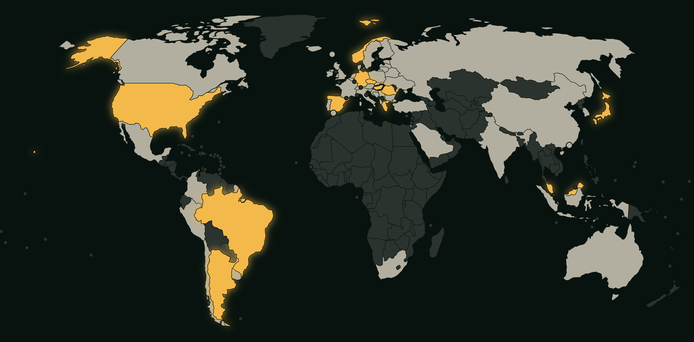

# FM Career Trophy Case

[](https://github.com/Marpheus/fm-career-trophy-case/actions/workflows/ci.yml)
[](LICENSE)


A world map of every league won in a Football Manager world-conquest save. Playable nations
start pale and turn gold once their top division is won; everything outside the loaded
leagues stays dark.



## Features

- **Clubs** — an interactive world map (pan, zoom, search) plus the continental club cups.
- **International** — the World Cup and every confederation's national team trophies.
- **Timeline** — the whole career season by season.
- **Home nations kept apart** — England, Scotland, Wales and Northern Ireland are separate
  nations, as they are in FM.
- **Grouped by confederation, not continent** — Türkiye and Israel sit in UEFA, Australia in
  AFC.
- **No account, no server** — everything is stored in your browser, with JSON export and
  import for backups.

## Tech stack

[Vue 3](https://vuejs.org) · [TypeScript](https://www.typescriptlang.org) ·
[Vite](https://vite.dev) · [Tailwind CSS v4](https://tailwindcss.com) ·
[d3-geo](https://d3js.org/d3-geo) + [topojson](https://github.com/topojson/topojson-client)
for the map · deployed on [Netlify](https://www.netlify.com)

## Getting started

Requires Node 22 (see `.nvmrc`).

```bash
npm install
npm run dev
```

| Script              | What it does                                         |
| ------------------- | ---------------------------------------------------- |
| `npm run dev`       | Start the dev server                                 |
| `npm run build`     | Type-check and build to `dist/`                      |
| `npm run typecheck` | Type-check only (`vue-tsc -b`)                       |
| `npm run build:map` | Regenerate map data from Natural Earth (rarely used) |
| `npm run format`    | Format everything with Prettier                      |

## Project structure

```
src/
├── components/    presentational Vue components
├── composables/   use-career (state + localStorage), use-world-map (geometry)
└── data/          nations, leagues, international trophies, playable set
scripts/           map and flag generation
public/data/       generated TopoJSON (committed)
```

## Customising

### Leagues and trophies

Each playable nation has exactly one league — its top division — and no cups. Winning it
colours the nation in on the map. Leagues and the continental club cups live in
`src/data/competitions.ts`, national team trophies in `src/data/international.ts`. Nation
codes must match those in `src/data/nations.json`.

League names are seeded from general knowledge, so sponsor names may not match your FM
version exactly. Rename freely; only the `nation` codes matter.

### Playable nations

Edit `src/data/playable.ts` — the set of nations with loaded leagues. Everything outside it
renders inert grey and is excluded from the completion totals.

### Map data

```bash
npm run build:map
```

Downloads Natural Earth's 50m subunit boundaries, dissolves them to nations, simplifies the
geometry and writes `public/data/world.topo.json` plus the nation index. Subunits rather
than countries, so the home nations stay separate. Output is committed; you only need this
when the nation list changes.

## Deploying

Netlify picks up `netlify.toml` automatically: build `npm run build`, publish `dist`.

## Back up your data

Everything lives in localStorage, which clearing your browser data will wipe. Use the
**Export** button regularly and keep the JSON somewhere safe; **Import** restores it.

## Credits

- Map boundaries: [Natural Earth](https://www.naturalearthdata.com) (public domain)
- Flags: [flag-icons](https://github.com/lipis/flag-icons) (MIT)

Not affiliated with Sports Interactive or SEGA. Football Manager is their trademark.

## License

[MIT](LICENSE)
